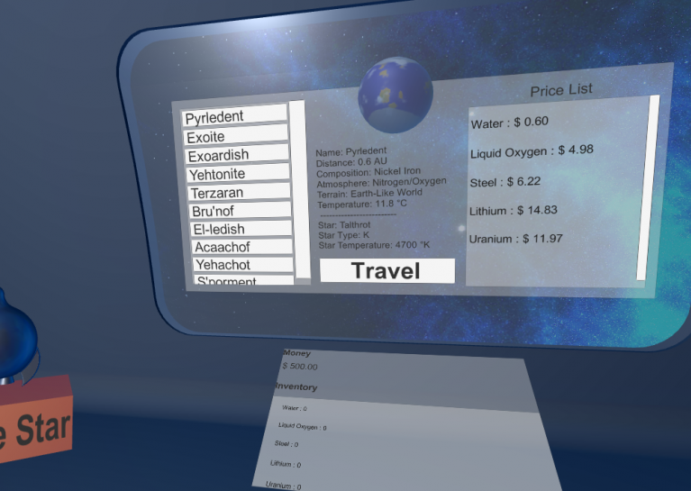

# Homeworlds
A VR Game for the Global Game Jam 2019, where you discover all the worlds people (cool looking aliens) call home, as you travel along the spaceship you call your home-away-from-home while you work your trader job.

Developed for the Google Daydream and Cardboard VR platforms using the Unity 3D game engine.

## Links
* Jam - https://globalgamejam.org/2019/games/homeworlds
* Released - https://samsarette.itch.io/homeworlds

## Screenshot

